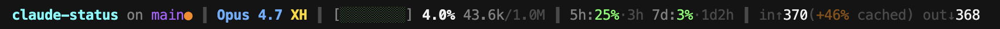
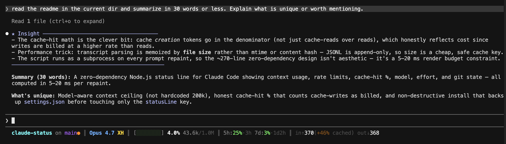

# claude-status - A Status Line for Claude Code

**A compact, information-dense status line for [Claude Code](https://claude.com/claude-code) showing context window usage, rate limits, cache-hit percentage, model, effort level, git branch, and session totals. Zero dependencies - just Node.js.**







`claude-status` replaces Claude Code's default status bar with a dense, color-coded read-out of everything that matters during a coding session: how much of your context window is used, how close you are to your 5-hour and 7-day rate limits, what percentage of input tokens came from the prompt cache (i.e., nearly free), plus the model, effort level, git state, and output style. It's a single ~270-line Node.js script - no npm dependencies, no background processes, no network calls.

## Features

- **Model-aware context window bar** - auto-detects the active model's ceiling (200k, 1M, etc.) from the Claude Code payload. Color shifts green → lime → yellow → orange → red as you fill.
- **Live rate-limit display** - shows `%` used and time-until-reset for both the Claude.ai 5-hour and 7-day quotas. Hidden for API-key users.
- **Cache-hit percentage** - parses the session transcript to compute the fraction of input tokens served from the prompt cache. Size-keyed cache keeps repaints cheap (typical render: 5–20 ms).
- **Effort badge** - `LO`·`MD`·`HI`·`XH`·`MX` color-coded from cheap → cost-danger, read from `~/.claude/settings.json.effortLevel`.
- **Git-aware** - directory name + branch, orange `●` for uncommitted changes, worktree badge when applicable.
- **Conditional badges** - vim mode (INS/NRM), subagent name, git worktree, non-default output style.
- **Zero dependencies** - pure Node.js standard library. No npm install, no background daemons.
- **Non-destructive install** - backs up `~/.claude/settings.json` with a timestamped filename before touching it. Leaves hooks, plugins, env, and permissions untouched.

## Install

### Option 1 - One-liner via npx (recommended)

```bash
npx claude-status
```

This runs the installer from the npm package. No clone required. Re-run any time to update to the latest version.

### Option 2 - From source

```bash
git clone https://github.com/waelmas/claude-status.git
cd claude-status
node install.js
```

After either install path, start a new Claude Code session (or reload) - the new status line appears on the next prompt.

### What the installer does

- Copies `statusline.js` → `~/.claude/statusline-command.js` (mode `0755`).
- Backs up your existing `~/.claude/settings.json` to `settings.json.backup-<timestamp>`.
- Sets `settings.json.statusLine` to `{ "type": "command", "command": "node ~/.claude/statusline-command.js" }`.
- Touches nothing else.

### Manual install

If you'd rather not run the installer:

1. Copy `statusline.js` somewhere stable (e.g. `~/.claude/statusline-command.js`).
2. In `~/.claude/settings.json`, add or update:
   ```json
   {
     "statusLine": {
       "type": "command",
       "command": "node /absolute/path/to/statusline-command.js"
     }
   }
   ```
3. Reload Claude Code.

## What it shows

Left to right, separated by `┃`:

| Segment | Example | Meaning |
|---|---|---|
| **Project + branch** | `claude-status on main●` | Directory name + git branch. Orange `●` = uncommitted changes. Branch truncates at 22 chars. |
| **Model + effort** | `Opus 4.7 XH` | Model name (strips parentheticals like `(1M context)`). Badge = effort level: `LO`·`MD`·`HI`·`XH`·`MX`, colored from meh (gray) → cost-danger (red). |
| **Context bar** | `[██░░░░░░] 28.4% 284k/1.0M` | Fill bar for context-window usage. Color shifts green → lime → yellow → orange → red as you fill. Ceiling adapts to the active model. |
| **Rate limits** | `5h:50%·3h  7d:54%·2d4h` | Claude.ai subscription quotas. `%` used + time until reset. Hidden for API-key users. |
| **Session totals** | `in↑12.2k(+98% cached) out↓353k` | Cumulative billed input + output tokens. `(+98% cached)` = fraction of input served from the prompt cache. |
| **Badges** *(conditional)* | `INS`  `⬡ agent`  `⎇ worktree`  `✳ style` | Only shown when present: vim mode, subagent name, git worktree, non-default output style. |

### How the numbers are computed

- **Context %, used, ceiling** - read directly from Claude Code's statusline JSON payload (`context_window.used_percentage`, `context_window_size`, etc.). Model-aware; no hardcoded 200k.
- **Billed input / output** - `context_window.total_input_tokens` / `total_output_tokens`. These track *uncached* input - what you actually pay for.
- **Cache-hit %** - computed by parsing the session transcript JSONL and summing `cache_read_input_tokens` across all assistant turns. Formula: `cache_read / (cache_read + cache_creation + fresh_input)`. Cache-creation is in the denominator because those tokens *are* billed (at the write rate). Cached by transcript file size to keep repaints cheap.
- **Rate-limit `%` and reset time** - read from `rate_limits.{five_hour,seven_day}.{used_percentage,resets_at}`.
- **Effort badge** - read from `~/.claude/settings.json.effortLevel`. Per-session `--effort` CLI overrides are *not* reflected - only the persistent setting.

### What resets when

| Action | Context % | `in↑`/`out↓` | Cache-hit % |
|---|---|---|---|
| New session (`/clear`) | resets | resets | resets |
| Compact (`/compact`) | drops | keeps growing | keeps growing |
| Resume session | continues | continues | continues |

So: drop in context bar + stable session totals = compaction. Everything at zero = new session.

## Customize

All styling lives at the top of `statusline.js`:

- **Colors** - edit the ANSI color constants (`GREEN`, `YELLOW`, `ORANGE`, etc.). They use 256-color codes (`c(n)`), so you can swap any to your preferred hue.
- **Thresholds** - `ctxBar()` defines when the bar turns lime / yellow / orange / red. `fmtRL()` defines the same for rate-limit colors. `cacheHitPct` thresholds are inline where the cached-% is rendered.
- **Effort badge labels / colors** - `EFFORT_MAP` object. Change `LO`·`MD`·`HI`·`XH`·`MX` labels or their colors.
- **Segment order / separator** - scroll to the bottom where `parts` is assembled. Reorder the `parts.push(...)` calls to taste. `SEP` defines the group separator.
- **Branch / model truncation** - `branch.length > 22` and `modelShort.length > 20`. Adjust for your terminal width.

## How Claude Code statusline scripts work

On every prompt repaint, Claude Code spawns your configured `statusLine.command` as a subprocess and pipes a JSON payload to its stdin. Your script writes ANSI-styled text to stdout, and that becomes the status line.

The payload includes (among other fields):

```json
{
  "session_id": "...",
  "transcript_path": "...",
  "cwd": "...",
  "model":  { "id": "...", "display_name": "..." },
  "workspace": { "current_dir": "..." },
  "context_window": {
    "total_input_tokens": 426,
    "total_output_tokens": 21654,
    "context_window_size": 1000000,
    "current_usage": { "input_tokens": 1, "cache_read_input_tokens": 53138, "...": "..." },
    "used_percentage": 6
  },
  "rate_limits": {
    "five_hour":  { "used_percentage": 50, "resets_at": 1776733200 },
    "seven_day":  { "used_percentage": 54, "resets_at": 1776970800 }
  }
}
```

Rendering a status line is pure formatting - almost every number you'd want is pre-computed by Claude Code. The only exception is the cache-hit %, which requires summing per-turn values across the transcript JSONL.

## Performance

Every prompt repaint invokes the script, so it's engineered to be cheap:

- **Git calls** use `GIT_OPTIONAL_LOCKS=0` so they never wait on a lock held by another process.
- **Transcript parsing** (for cache-hit %) is cached by transcript file size in `os.tmpdir()`. The JSONL file is append-only, so a matching size means nothing has changed and we reuse the cached totals. Fresh turns invalidate the cache and trigger one re-parse.
- **No network calls, no dynamic dependencies, no background processes.**

Typical render time: **5–20 ms**.

## Uninstall

```bash
npx claude-status uninstall
```

Or manually:

1. Remove the `statusLine` key from `~/.claude/settings.json`.
2. Delete `~/.claude/statusline-command.js`.
3. Optionally delete cached transcript totals: `rm /tmp/statusline-cache-*.json` (macOS/Linux) or the equivalent in `%TEMP%` on Windows.

## FAQ

**Q: Does claude-status work with both Claude.ai subscriptions and API keys?**
A: Yes. Rate-limit segments are automatically hidden when the `rate_limits` field is absent from the payload (the API-key case). Everything else - context window, model, cache stats - works identically.

**Q: Does it work with Claude Code plugins, hooks, or output styles?**
A: Yes. The installer only touches the `statusLine` key in `settings.json`. Hooks, plugins, permissions, env vars, and output styles are preserved. Non-default output styles show up as a `✳ style-name` badge.

**Q: Why is my cache-hit percentage lower than expected?**
A: Claude Code's prompt cache writes new entries at a *higher* token cost than reads (cache-write vs. cache-read pricing). `claude-status` counts cache-creation tokens in the denominator of the cache-hit % because they're billed (just at the write rate), so they're honestly "not a hit." Pure cache-read percentage would look higher but would overstate the cost savings.

**Q: Can I use this with git worktrees?**
A: Yes. When a Claude Code session is in a git worktree, the `⎇ worktree-name` badge appears. Branch, dirty state, and project name all resolve correctly inside worktrees.

**Q: Does it support vim mode?**
A: Yes. When `input.vim.mode` is present, an `INS` (green) or `NRM` (yellow) badge appears.

**Q: Is claude-status affiliated with Anthropic?**
A: No. It's an independent open-source project. Claude Code is Anthropic's official CLI; `claude-status` is a community-built renderer for the `statusLine` extension point that Claude Code exposes.

**Q: Does it run on Windows?**
A: Yes, on Windows with Node.js installed. The installer uses cross-platform path joins. On Windows, the temp cache lives in `%TEMP%` instead of `/tmp`. Git commands work via the system `git` on PATH.

**Q: How do I change colors or the segment order?**
A: Edit `~/.claude/statusline-command.js` directly after install - color constants and the `parts.push(...)` assembly are at the top and bottom of the file respectively. See the **Customize** section above.

**Q: Will heavy transcript parsing slow down my prompt?**
A: No. The cache-hit % calculation is memoized by transcript file size and stored in `os.tmpdir()`. A repaint with no new assistant turns is effectively free. Full typical render time is 5–20 ms.

## Contributing

Issues and PRs welcome at [github.com/waelmas/claude-status](https://github.com/waelmas/claude-status). Scope is intentionally narrow: a fast, zero-dependency status line. New segments should keep the "5–20 ms render" budget.

## License

MIT - see [LICENSE](./LICENSE).
